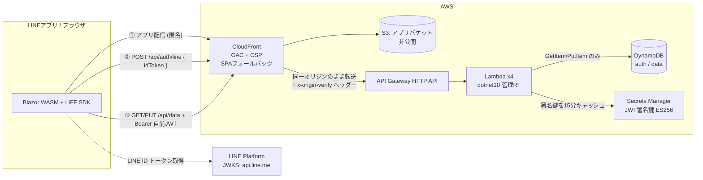

# template-aws-line-miniapp

LINE ミニアプリ（LIFF）向けの、**ユーザ別 JSON データ管理サービス**のテンプレート。
Blazor WebAssembly（.NET 10）を CloudFront + S3 で配信し、LINE ログインで認証、ユーザーごとの少量 JSON を DynamoDB に保存する。

認証は **2 トークン方式**（LINE の ID トークン → 自前 JWT に載せ替え）で、「このリクエストは誰のものか」を偽造不可能な形で確定させることだけに集中している。設計思想の全文は [SPEC.md](SPEC.md)（およびその上流の `line-miniapp-spec-v2.md`）を参照。

> このテンプレートは [template-aws-s3-wasm](../template-aws-s3-wasm) と同じプロジェクト構造・ビルド/デプロイ手順・コーディング規約を踏襲している。認証だけが Cognito から LINE + 自前 JWT に置き換わり、データストアが S3 から DynamoDB に変わっている。

---

## 📖 概要

### できること

- LINE（LIFF）でサインインし、**そのユーザー自身の JSON データだけ**を取得・保存できる
- 楽観ロック（`version`）で、複数端末の同時編集による上書き消失を防ぐ
- 退会（`DELETE /api/account`）で認証マッピングとデータを 1 トランザクションで削除する
- インフラ一式が CDK (C#) で再現でき、数コマンドでデプロイ・削除できる
- **LINE 実機なしで**主要機能を AWS 上で自動検証できる（テスト用 JWKS 機構）

### 設計の中心思想（[SPEC.md](SPEC.md) §1 より）

1. **クライアントを一切信頼しない** — エンドポイントは誰でも `curl` で叩ける。守るのは「誰のリクエストか」の確定だけ
2. **信頼の連鎖** — LINE の秘密鍵 → LINE 公開鍵で検証 → 自前秘密鍵で署名 → 自前公開鍵で検証 → DynamoDB の PK。どこにもクライアントの善意が入らない
3. **認可を if 文でなくキー構造にする** — `PK = USER#{トークン由来の internalUserId}`。API のシグネチャに `userId` が存在しないため、他人のデータへ渡す経路自体が無い

---

## 🏗️ アーキテクチャ



S3 は**静的ファイル配信のみ**。ユーザーデータ用バケットは作らない（データは DynamoDB）。

### AWS リソース

| リソース | 用途 | 要点 |
|---|---|---|
| S3（アプリ） | Blazor publish 出力 | パブリックアクセス全ブロック / OAC のみ / dev は autoDelete |
| CloudFront | アプリ配信 + API 前段 | OAC / HTTPS 強制 / 403・404→`/index.html` / セキュリティヘッダー + CSP / `/api/*` はキャッシュ無効・`x-origin-verify` 付与 |
| API Gateway HTTP API | API の入口 | オーソライザーなし（JWT 検証は Lambda 内）。dev のみ localhost CORS。ステージスロットリング |
| Lambda ×4 | auth-line / data-get / data-put / account-delete | dotnet10 管理ランタイム / 256MB / 10秒 / 1 publish 成果物を共有 |
| DynamoDB ×2 | AuthTable / DataTable | オンデマンド / PITR は prod のみ / dev は DESTROY |
| Secrets Manager | JWT 署名鍵（ES256 PEM） | CDK は器のみ、値は `init-jwt-key.ps1` で投入。Lambda は 15 分キャッシュ |
| CloudWatch Logs | Lambda ログ | dev 1週間 / prod 1か月 |

### なぜ Lambda 内で JWT を検証するのか（S3+Cognito テンプレートとの違い）

template-aws-s3-wasm は API Gateway の JWT オーソライザーで認証する。本テンプレートは**アプリが自前で JWT を発行・検証する**ため、認証は Lambda 内（`OriginVerifyFilter` + `OwnTokenValidator`）で行う。API Gateway が担うのはルーティングとスロットリングだけで、認証・認可はすべてコード側にある。これは v2 仕様の 2 トークン方式（LINE の 1 時間制約を回避するための自前 JWT）を成立させるための必然的な帰結。

### Lambda の実装形態（AmazonLambdaExtension）

ハンドラーは [AmazonLambdaExtension](https://github.com/usausa/amazon-lambda-extension)（ソースジェネレーター。NuGet `2.0.0-beta4`、ジェネレーター同梱）で記述している。

- `[Lambda]` を付けた単一クラス `MiniAppFunction` に `[HttpApi(method, path)]` メソッド×4。各メソッドの Lambda エントリポイント `{Method}_Handler` が同クラスに生成される
- パラメーターは `[FromBody]`（SG ベースの JSON + DataAnnotations 検証で不正 JSON は 400）と `[FromHeader("authorization")] string authorization = ""` で受ける（ヘッダーは**既定値必須**。`string?` などの null 許容注釈型はバインディング非対応 = ALE0019）
- x-origin-verify の検証は `ILambdaFilter`（`OriginVerifyFilter`）としてクラス共通に適用。JWT 検証は「`sub` の出所が検証済みトークンのみ」を可視に保つため、あえて各ハンドラー先頭に置いている
- DI は `[ServiceResolver(typeof(ServiceResolver))]` + `ServiceResolver.ConfigureServices()`。`ILambdaSerializer` / `IBodySerializer` / `IRequestValidator` もここで登録する
- `[HttpApi]` のルートテンプレートはドキュメント兼ルートパラメーターバインディング用で、実ルーティングは CDK 側にある（テンプレートの「インフラ記述を1箇所に」方針を維持）
- Amazon.Lambda.Annotations と異なり `serverless.template` は生成されない（削除ターゲット不要）

> 変換前の Amazon.Lambda.Annotations 版は `../template-aws-line-miniapp-backup` にスナップショットとして保存してある。

---

## 🔐 認証（2 トークン方式）

| | LINE ID トークン | 自前 JWT |
|---|---|---|
| 発行者 | LINE ヤフー | 自 Lambda |
| 署名 | ES256（LINE 秘密鍵、JWKS で検証） | ES256（Secrets Manager の鍵） |
| 有効期限 | **1時間・変更不可** | **7日**（`JWT_LIFETIME_DAYS`） |
| 検証場所 | `POST /api/auth/line` のみ | 全保護 API（Lambda 内共通） |
| 保管場所 | LIFF の localStorage（触らない） | **メモリのみ**（`TokenStore`。localStorage 禁止） |

起動直後に ID トークンを 1 回だけ自前 JWT に交換し、以後 LINE トークンは使わない。これで「1 時間で黙って壊れる」問題が設計から消える。詳細と 4 つの期限切れ状態は [SPEC.md](SPEC.md) §4 / `line-miniapp-spec-v2.md` §2〜3。

自前 JWT のクレーム: `sub`=internalUserId（`usr_`+GUID v7）、`line_sub`=lineUserId（退会時の AuthTable 削除にのみ使用・**ログ出力禁止**）。

---

## 📇 データモデル（DynamoDB）

| テーブル | PK | その他 |
|---|---|---|
| AuthTable | `LINE#{lineUserId}` | `internalUserId`, `createdAt` |
| DataTable | `USER#{internalUserId}` | `data`(JSON文字列), `version`(楽観ロック), `updatedAt` |

ソートキーなし / GSI なし / オンデマンド。1 ユーザー 1 アイテム、アクセスパターンは 1 種類。`Scan`/`Query` は IAM で明示 Deny（[SPEC.md](SPEC.md) §9.4）。

---

## 🔧 テンプレートから新規プロジェクトを作る

置き換える対象は 2 系統。

| 系統 | 現在の値 | 使われる場所 |
|---|---|---|
| プロジェクト名（PascalCase） | `Template` | 名前空間・プロジェクト名・ディレクトリ名・アセンブリ名・**Lambda ハンドラー名** |
| デプロイ名（kebab-case） | `template-aws-line-miniapp` | CloudFormation スタック名・S3 名の一部 |

リポジトリルートで実行（先頭 2 行を自分の値に変える）:

```powershell
$Name   = 'Acme'              # PascalCase。名前空間・アセンブリ名になる
$Deploy = 'acme-miniapp'      # kebab-case。CloudFormation スタック名になる

# 1. ファイル内容を置換（.git と成果物ディレクトリは除外）
Get-ChildItem -Recurse -File |
    Where-Object { $_.FullName -notmatch '\\(\.git|bin|obj|publish|publish-api|cdk\.out|node_modules)\\' } |
    ForEach-Object {
        $body = Get-Content $_.FullName -Raw
        $new = $body.Replace('Template.', "$Name.").Replace('template-aws-line-miniapp', $Deploy)
        if ($new -ne $body) { Set-Content $_.FullName $new -NoNewline }
    }

# 2. プロジェクトファイルとディレクトリをリネーム
foreach ($p in 'Backend', 'Frontend', 'IaC') {
    Rename-Item "Template.$p/Template.$p.csproj" "$Name.$p.csproj"
    Rename-Item "Template.$p" "$Name.$p"
}
Get-ChildItem -Filter 'Template.*.slnx' | ForEach-Object { Rename-Item $_.FullName ($_.Name -replace '^Template', $Name) }

# 3. 確認
dotnet build
```

> ⚠️ 置換は必ず**ドット付きの `Template.`** で行う（`Template` 単体だと本文の「テンプレート」等を巻き込む）。
> ⚠️ 最も事故るのは `Template.IaC/ApiConstruct.cs` の **Lambda ハンドラー名**。文字列がずれても `cdk deploy` は成功し、**API 呼び出しだけが実行時に 500** になる。上の置換で直るが、手作業リネーム時はここを最初に疑う。

---

## 🚀 セットアップ（初回構築）

### 必要なもの

- .NET SDK 10.0+
- Node.js 20+（CDK CLI 実行用）
- AWS CLI v2（認証情報設定済み）
- PowerShell 7+

### 事前設定

`Template.IaC/cdk.json` の各環境の値を設定する。

| キー | 内容 |
|---|---|
| `lineChannelId` | LINE ミニアプリ / LINE ログインチャネルの ID（ID トークンの `aud` 検証に使う） |
| `liffId` | デプロイ先（CloudFront）を endpoint URL に設定した LIFF アプリの ID |
| `liffIdLocal` | ローカル開発用（`https://localhost:5250`）の LIFF アプリの ID（dev のみ） |
| `allowLocalhost` | dev は `true`（HTTP API に localhost CORS を付与） |
| `testJwks` | dev のみ `true` 可（テスト用 JWKS を使い、実機なしで検証可能にする）。**prod で true にすると synth が失敗する** |

> 同梱の `dev` は自動検証がそのまま通るダミー値（`lineChannelId: "2000000001"` 等）が入っている。実機で使うときは実値に置き換える。

### 構築手順

```powershell
# 1. Lambda 成果物を用意（CDK がアセットとして取り込む）
./scripts/deploy-api.ps1

# 2. インフラをデプロイ
cd Template.IaC
npx --yes aws-cdk@latest bootstrap        # アカウント×リージョンで初回のみ
npx --yes aws-cdk@latest deploy -c env=dev --require-approval never --outputs-file ../cdk-outputs.dev.json
cd ..

# 3. JWT 署名鍵を投入（冪等。既に本物の鍵があればスキップ）
./scripts/init-jwt-key.ps1 -Env dev

# 4. アプリをビルドして配信
./scripts/deploy-app.ps1 -Env dev

# 5. (自動検証) 実機・LINE 設定なしで受け入れテストを実行
./scripts/test-acceptance.ps1 -Env dev

# 6. (実機検証) LINE Developers で LIFF エンドポイント URL を CloudFront ドメインへ変更し、
#    LINE アプリから LIFF URL を開く
```

最初のマイルストーンは「`POST /api/auth/line` の疎通」。`testJwks` により**実機前に**確認できる。

---

## ✅ 受け入れテスト（`test-acceptance.ps1`）

dev + `testJwks=true` 前提。スクリプトが P-256 テスト鍵を生成し、その公開鍵を**テスト用 JWKS** としてアプリバケットに配置、秘密鍵で LINE 形式の ID トークンを偽造して、`POST /api/auth/line` 以降の全経路を実 AWS 上で検証する（テスト鍵は本物の LINE 鍵ではなく、dev が `LINE_JWKS_URL` をこの JWKS に向けているからのみ通る）。

| # | テスト | 期待 |
|---|---|---|
| 1 | トークンなしで `GET /api/data` | 401 |
| 2 | `?userId=...` は無視される（API に受け口がない） | パラメータ有無で同じ結果 |
| 3 | 自前 JWT の `sub` を改ざん | 401（署名不一致） |
| 4 | `alg=none` の JWT | 401 |
| 5 | 期限切れ LINE ID トークンで交換 | 401（exp 検証） |
| 6 | `aud` が別チャネルの LINE トークンで交換 | 401 |
| 7 | 古い version で `PUT` | 409 |
| 8 | 300KB 超の `PUT` | 413 |
| 9 | execute-api へ直接アクセス（CloudFront 迂回） | 403（`x-origin-verify` なし） |
| 10 | ライフサイクル（交換→204→PUT→GET→退会→204） | 全 PASS |
| 11 | 同一 LINE ユーザーは同じ internalUserId、退会後は新規発行 | PASS |

**検証実績（2026-08-30）**: dev 環境に一度デプロイし、上記 11 項目すべて PASS を確認、フロント配信（CSP・WASM ブート）も確認したうえで**削除済み**。同日の AmazonLambdaExtension への実装変換後にも再デプロイして全 11 項目 PASS を再確認し、再び**削除済み**。AWS 上にスタックは存在しない。

---

## 🧹 削除（片付け）

```powershell
cd Template.IaC
npx --yes aws-cdk@latest destroy -c env=dev --force
cd ..
```

dev は全リソース DESTROY 指定のため原則残骸なし。ただし CDK 内蔵のバケット空化 Lambda の LogGroup（`/aws/lambda/{スタック名}-CustomS3AutoDeleteObject-*`）だけは CloudFormation 管理外のため残ることがある（空・無課金）。気になる場合は手動削除:

```powershell
aws logs describe-log-groups --query "logGroups[?contains(logGroupName,'template-aws-line-miniapp')].logGroupName" --output text |
    ForEach-Object { $_ -split '\s+' } | Where-Object { $_ } |
    ForEach-Object { aws logs delete-log-group --log-group-name $_ }
```

**prod** はバケット・DynamoDB・Secret が RETAIN のため、スタック削除後に手動削除が必要（データ保全のための意図的な設計）。

残骸確認:

```powershell
aws cloudformation describe-stacks --stack-name template-aws-line-miniapp-dev   # 存在しないエラーが正
aws s3api list-buckets --query "Buckets[?contains(Name,'template-aws-line-miniapp')].Name"
aws dynamodb list-tables --query "TableNames[?contains(@,'template-aws-line-miniapp')]"
aws secretsmanager list-secrets --include-planned-deletion --query "SecretList[?contains(Name,'SecretJwtSigningKey')].Name"
```

---

## 📁 プログラム構成

```
template-aws-line-miniapp/
├── SPEC.md                                  ← 実装仕様（v2 仕様からの写像。本 README の上流）
├── Template.Backend/                        ← Lambda (net10.0, 管理 dotnet10)
│   ├── ServiceResolver.cs                   ← DI 登録（[ServiceResolver] から参照）
│   ├── Functions/MiniAppFunction.cs         ← [Lambda] + [HttpApi]×4（Login/GetData/PutData/DeleteAccount）
│   ├── Filters/OriginVerifyFilter.cs        ← x-origin-verify 検証（ILambdaFilter・クラス共通）
│   ├── Application/BackendOptions.cs        ← 環境変数の読み取り
│   ├── Services/                            ← LineTokenValidator / SigningKeyProvider / JwtIssuer / OwnTokenValidator / UserRepository
│   └── Models/                              ← Contracts（Login/Data/Put。DataAnnotations 検証付き）
├── Template.Frontend/                       ← Blazor WebAssembly (net10.0)
│   ├── Services/                            ← LiffService / TokenStore（メモリ保持）/ ApiClient（401時1回だけ再交換）
│   ├── Components/Pages/                    ← Home / Data / Account / NotFound
│   └── wwwroot/js/liff-interop.js           ← v2 §3.2 のラッパー（外部ファイル。CSP のため）
├── Template.IaC/                            ← AWS CDK (C#)
│   ├── Infrastructure.cs                    ← スタック本体 + Outputs
│   ├── HostingConstruct.cs                  ← S3 + CloudFront（/api/* + x-origin-verify + CSP）
│   ├── ApiConstruct.cs                      ← HTTP API + Lambda ×4 + IAM（Scan/Query 明示 Deny）
│   ├── DataConstruct.cs / SecretConstruct.cs
│   └── EnvironmentConfig.cs / cdk.json / Program.cs
├── scripts/                                 ← 下記
└── README.md / AGENTS.md / Analyzers.ruleset / Directory.Build.*
```

### scripts 一覧

| スクリプト | 用途 |
|---|---|
| `deploy-api.ps1` | Template.Backend を `publish-api/` へ publish（**cdk deploy の前**に必須。destroy 時も必要） |
| `init-jwt-key.ps1` | ES256 鍵ペアを生成し Secrets Manager へ投入（冪等。`-Force` で再生成＝既存 JWT 全失効） |
| `update-appsettings.ps1` | ローカル開発用 `appsettings.Development.json` を生成（LiffId は local 用） |
| `deploy-app.ps1` | Template.Frontend を publish → S3 sync → immutable キャッシュ昇格 → Brotli 差し替え → invalidation |
| `test-acceptance.ps1` | 上記の自動受け入れテスト（dev + testJwks 前提） |
| `common.ps1` | 共通処理（cdk outputs 読み取り等）。直接実行しない |

---

## 💻 ローカル開発

```powershell
./scripts/update-appsettings.ps1 -Env dev
dotnet run --project Template.Frontend       # https://localhost:5250
```

- LIFF は https 必須のため、ローカル用 LIFF アプリのエンドポイントを `https://localhost:5250` に設定しておく（`dotnet dev-certs https --trust` が前提）。
- API は dev スタックの CloudFront `/api/*` を呼ぶ（クロスオリジン。dev のみ HTTP API に localhost CORS を設定済み）。CloudFront 経由なので `x-origin-verify` は付与され、テスト 9 の直接アクセス遮断とは両立する。

---

## 🛡️ セキュリティ

| 攻撃 | 結果 | 止まる場所 |
|---|---|---|
| `curl` で API を直接叩く | 401 | トークンなし |
| `userId=他人` をパラメータに入れる | 無視 | サーバが `userId` を受け取らない |
| JWT の `sub` を書き換え | 401 | 署名検証 |
| `alg` を `none`/`HS256` に | 401 | `ValidAlgorithms=[ES256]` 固定 |
| 別チャネルの LINE トークン | 401 | `aud` 検証 |
| WASM を改造して再配布 | **何も起きない** | サーバが全判断 |
| execute-api へ直接（CloudFront 迂回） | 403 | `x-origin-verify`（多層防御。突破されても JWT 検証が残る） |

- **CSP は CloudFront で付与**（`HostingConstruct.Csp`）。`connect-src` は `'self'` + `api.line.me`、`script-src` は `'self' 'wasm-unsafe-eval'` + `static.line-scdn.net`、`img-src` に `profile.line-scdn.net`。LIFF SDK の通信先は公式に網羅列挙されていないため、実機で CSP violation が出たらホストを追記する。
- 自前 JWT は **localStorage に保存しない**（メモリのみ）。`lineUserId` はログ出力しない。生トークンは画面表示しない。
- 署名鍵は Secrets Manager のみ。環境変数には ARN だけ（鍵素材は置かない）。

詳細は [SPEC.md](SPEC.md) §10 と `line-miniapp-spec-v2.md` §8。

---

## 💰 ランニングコスト

| サービス | デモ運用（数ユーザー） | 10万 MAU |
|---|---|---|
| DynamoDB | 〜$0.01 | 〜$3 |
| Lambda | $0（無料枠） | 〜$2 |
| CloudFront + S3 | $0〜0.01 | $5〜10 |
| API Gateway (HTTP API) | 〜$0.01 | 〜$4 |
| Secrets Manager | $0.40 | $0.40 |
| **合計** | **約 $0.4/月** | **約 $15〜20/月** |

Secrets Manager の $0.40/月以外はほぼ無料枠。本番で API Gateway のリクエスト課金が問題になる規模なら、v2 仕様どおり Lambda Function URL + OAC へ置き換える（ルーティングを単一 Lambda に寄せる設計変更を伴う）。

---

## 📋 既知の制約

| 項目 | 内容 |
|---|---|
| Lambda コールドスタート | 管理ランタイムのため初回に JIT ウォームアップ（実測 700ms 程度）。詰めるなら Native AOT だが Windows→Linux ビルドに Docker が要るため不採用 |
| CSP のホスト網羅 | LIFF SDK の通信先が非公開。実機初回テストで violation を確認し追記する（[SPEC.md](SPEC.md) §10.1） |
| フロント初回ダウンロード | WASM + AOT で数 MB。ミニアプリは LINE 内でキャッシュが効きやすい前提で許容（[SPEC.md](SPEC.md) §1 #6） |
| testJwks | dev 専用。prod では EnvironmentConfig が synth 時に例外を投げ、構造的に持ち込めない |
| 現在のデプロイ状態 | 一度デプロイ・検証して**削除済み**。AWS 上にスタックは無い |
| CI/CD | 未同梱 |

---

## 📄 ライセンス

[LICENSE](LICENSE) を参照。
